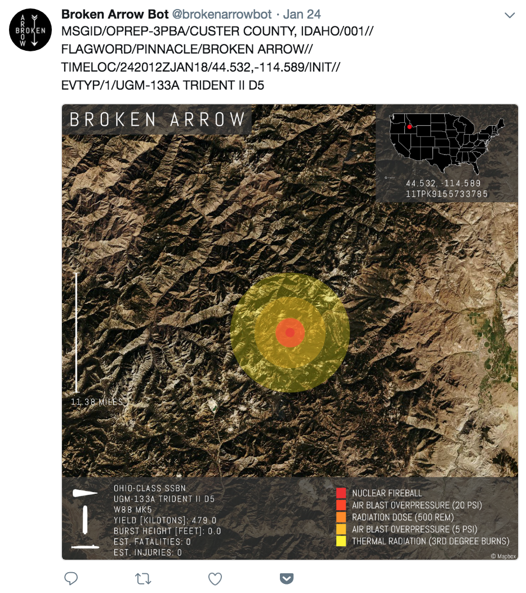

# node-broken-arrow-bot

### NOTE: SEE *PERMISSIONS* SECTION BELOW FOR IMPORTANT INFORMATION ABOUT THE CODE!

The Broken Arrow Bot ([@brokenarrowbot](https://twitter.com/brokenarrowbot)) uses basic technical details of the [US Nuclear Triad](https://armscontrolcenter.org/factsheet-the-nuclear-triad/) to randomly generate a 'Broken Arrow' event for a nuclear weapon. A location in the continental United States is picked at random and a nuclear explosion is simulated by calculating the blast radii of various nuclear effects (fireball, overpressure, thermal radiation, etc). All of this information is then used to generate an image and text describing the Broken Arrow event, which is then posted to Twitter.

### WHY DID YOU MAKE THIS?

In the past year, I had my first ever nightmare about a nuclear apocalypse in my city. Surely a person in modern society doesn't worry about these things, I thought? And yet, the ever-present news of recent geopolitical events had found its way into my subconscious, causing me to experience real fear about the nuclear threat. If I was having these fears and dreams, surely others must be too?

So I decided to channel that anxiety into learning more about nuclear weapons and create something that attempts to make them more real. They have an odd way of being both terrifying and yet unknowable, as if the scale of their danger is too great to fully grasp in the context of modern life. 

The idea to build a Twitter bot about nuclear weapons was heavily inspired by the website [NUKEMAP](https://nuclearsecrecy.com/nukemap/), an interactive web map that shows the effects of various nuclear weapons on major cities around the world. Like the NUKEMAP, I hope that the Broken Arrow Bot helps people better understand what these weapons can do in the context of the world around them.  

### HOW DOES IT WORK?

The heart of this Twitter bot is a dynamic image generator that uses the Node-based image processing library [Jimp](https://github.com/oliver-moran/jimp) to create a composite image of stacked layers. The result is an image that shows a satellite image of a random location with information about a nuclear weapon and the size of its blast effects. 

It relies on the Mapbox Static API to both generate a [satellite image](https://www.mapbox.com/api-documentation/#maps) as a base layer and create a minimap with a higlighted location using a [custom marker](https://www.mapbox.com/api-documentation/#retrieve-a-static-map-from-a-style). Additional masks, icons and text are dynamically layered to build up a final composite image.

And finally, the entire Node.js project was uploaded to AWS Lambda for full Twitter bot functionality.

### PERMISSIONS

In my rush to make-an-idea-happen, I never stopped to think about asking permission to use two resources that this bot relies on. Specifically, I had used a very complex nuclear effects calculation script (nukeeffects.js) and an undocumented API for estimating nuclear blast casaulties, both of which are resources of the NUKEMAP web app. 

I've reached out to the author of NUKEMAP, [Dr. Alex Wellerstein](http://blog.nuclearsecrecy.com/about-me/), asking for his permission to use either the code or the API resource, but I did not receive a response. Therefore, I decided to disable the Twitter bot. Lesson learned! 

In the code hosted on this repo, I've .gitignore'd the nukeeffects.js library and disabled the request calls to the API resource. If you want to actually run this code locally (with the Tweeting disabled), you'll need to get the nukeeffects.js library from the NUKEMAP website and add it to a 'js' folder, making the below edits to the .js file.

~~~~
//var bc = new NukeEffects();

module.exports = {
	NukeEffects: NukeEffects
};
~~~~

Also, you'll need to add a config.js file that exports all of your own token keys. If you don't plan on tweeting, you can skip the Twitter tokens but you'll need your own [Mapbox token](https://www.mapbox.com/help/how-access-tokens-work/).

~~~~
module.exports = {
  mapbox_token: '[MAPBOX_TOKEN]',
  twitter_consumer_key: '[TWITTER_CONSUMER_KEY]',  
  twitter_consumer_secret: '[TWITTER_CONSUMER_SECRET]',
  twitter_access_token: '[TWITTER_ACCESS_TOKEN]',  
  twitter_access_token_secret: '[TWITTER_ACCES_TOKEN_SECRET]'
}
~~~~

### WHAT IS A BROKEN ARROW?

The [Department of Defense Manual 3150.08-M](http://www.esd.whs.mil/Portals/54/Documents/DD/issuances/dodm/315008m.pdf) defines 'Broken Arrow' as...

>"An unexpected event involving nuclear weapons or radiological nuclear weapon components that results in:
><ul>
><li>Accidental or unauthorized launching, firing, or use by U.S. forces or U.S.-supported allied
>forces of a nuclear-capable weapon system that could create the risk of an outbreak of war.</li>
><li>Loss or destruction of a nuclear weapon or radiological nuclear weapon component,
>including jettisoning.</li>
><li>An increase in the possibility of, or actual occurrence of, an explosion, a nuclear detonation,
>or radioactive contamination.</li>
><li>Nonnuclear detonation or burning of a nuclear weapon or radiological nuclear weapon
>component.</li>
><li>Public hazard, actual or implied.</li>
><li>Any act of God, unfavorable environment, or condition resulting in damage to the weapon,
>facility, or component.</li>
</ul>

### TWITTER

I curently follow a very interesting mix of nuclear nonprofileration, policy and anthropology experts on Twitter. Here's an incomplete list of people and organizations that I highly recommend checking out if you're interested in learning more!

* [@wellerstein](https://twitter.com/wellerstein)
* [@nuclearkatie](https://twitter.com/nuclearkatie)
* [@casillic](https://twitter.com/Casillic)
* [@nukestrat](https://twitter.com/nukestrat)
* [@georgewherbert](https://twitter.com/GeorgeWHerbert)
* [@cherylrofer](https://twitter.com/CherylRofer)
* [@nuclearanthro](https://twitter.com/NuclearAnthro)
* [@kingstonareif](https://twitter.com/KingstonAReif)
* [@nuclearban](https://twitter.com/nuclearban)
* [@beafihn](https://twitter.com/BeaFihn)
* [@kelseydav](https://twitter.com/KelseyDav)
* [@bulletinatomic](https://twitter.com/BulletinAtomic)
* [@armscontrolwonk](https://twitter.com/ArmsControlWonk)

